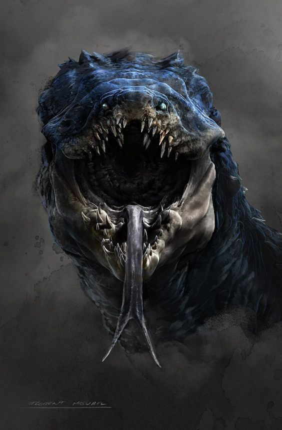
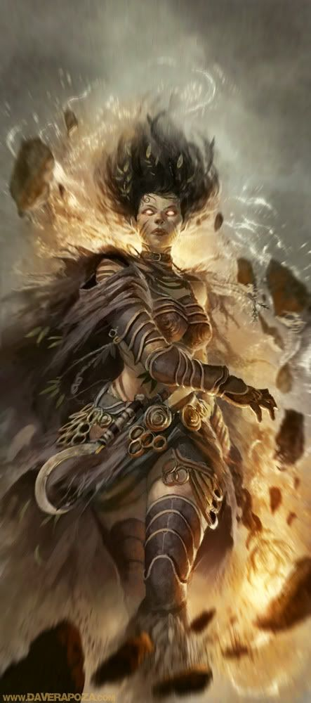

# Night of Blood, Mythic style

## Introduction

This is a writeup of an adventure from Warhammer Fantasy Roleplaying Game called [Night of Blood](https://www.drivethrurpg.com/product_reviews_info.php?&reviews_id=234021&products_id=259967?affiliate_id=909715) using a mix of [Fate Core](https://www.drivethrurpg.com/product/114903/Fate-Core-System?affiliate_id=909715) and [Legends of Anglerre](https://en.wikipedia.org/wiki/Legends_of_Anglerre). It is also a demonstration on how to randomize an adventure using the Mythic Game Master emulator. To understand the mechanics of what I'll be doing here, please watch the appropriate video on my Youtube channel, [RPGTips](https://www.youtube.com/channel/UCp_qWaHM9O5dz7gMiXpqKnQ) or read the [rules document](../mechanics.md). Please note that, since this was the first example I did, the rules were in active development *while* I played, so they increase in complexity as the scenes unfold.

When writing the actual adventure:

- Story will be written like this.

- *Fate Core rules and my own comments and notes will be written like this.*

- **Mythic checks and general GM questions will be written like this**.

I will be playing in the homebrew world of my [Godbound](https://www.drivethrurpg.com/product/185959/Godbound-A-Game-of-Divine-Heroes-Free-Edition?affiliate_id=909715) campaign, Morvaidia. Specifically, in the nation of Valmaria, a proud domain of humans who, after the disappearance of Becquia, the goddess of nature, learned how to use the Primordial Branch that gave life to everything and harness its energies through complicated rituals and runes, achieving magical capabilities. They are called Runic Sculptors, and they are the benevolent rulers of Valmaria. Every Runic Sculptor has one assigned guardian, a Donic Protector, heavily armored warriors trained in the usage of huge two handed swords, who swear their life to protect their Sculptor.

I will play as Evard Hortig, a novice Runic Sculptor, who hasn't passed his ascendancy test yet. He will be protected by Korbinian Lindemann, a soldier built like a barrel, who was Evard's mother guardian until her sudden disappearance. He's helping the young Hortig searching for her. I will decide Evard's actions, while Korbinian's will be generated randomly according to his personality (which, I hope, will develop organically during the game). As my world is not the Old World of Warhammer, I'll adapt the inconsistencies to something equivalent, which will also add a nice touch of surprise to the game.

## The adventure

Night of Blood starts with the party traversing a forest, at night, with a heavy rain, with the potential of being attacked by beastmen. This makes the party seek refuge in an inn, which has been recently overrun by demonic cultists who are trying to summon an infernal entity by sacrificing the inn patrons in the basement. I will start in the forest, and let Mythic take the lead, while ensuring that the party reaches the inn. Thus, I will play the high level narrative, but I will let Mythic alter almost everything else.

## Scene 1: The Forest
### Mechanics

*Adventure setup: while in the midst of a heavy storm in the forest, the party hears the approach of a Beastmen hunting party.*

**Is the scene setup altered in any way? Mythic Variations 2 (MV2) Fate Check (no bonus) = Exceptional No.**
*Well, it seems the first scene is going to start, at least, exactly like the adventure sets it. It could still be altered from the scene setup mechanics of Mythic.*

#### NPCs

- People of Valmaria.
- Runic Sculptors.
- Donic Protectors.

#### Threads

- Cross the forest safely to reach the city of Elencia.
- Investigate Evard's mother disappearance.

#### Scene setting

**Chaos Factor = 5.**

**Setup: the party is crossing a forest at night, under a heavy rain.**

**Chaos Factor roll = 8. Scene develops normally.**

### Story

Evard is walking, slowly, keeping a small telekinesis shield over Korbinian to keep the torch lit under the heavy rain. The sides of his bluish violet tunic are soaking wet. All of a sudden, a loud sound blares in the distance.

> There are no beastmen in Morvaidia, so I should generate something equivalent: **(Description Table) Threateningly Lonely.**
> Do the characters know what this is? I roll Lore for both of them. 2 for Evard and 1 for Korbinian. Yes, they do.

"What is a dombara doing in this area?", exclaims Korbinian. Evard is immediately worried. Dombaras are extremely large serpentine beasts that are rumored to live in the mountains to the east. They are poisonous and have the strength of ten men.

> **Does Korbinian want to run? Fate Check, prob +4 = Exceptional Yes.**

"We should leave. Now. Run, kid, don't worry about the rain. There are worse things to worry about now" Evard starts running, clumsily, through the trees.

> **Is there enough light to see anything without the torch? Fate Check, 50/50: Yes.**

Korbinian puts out the torch and starts running behind Evard, watching his steps for any kind of possible adverse surprise.

> **Does the dombara hear them? (+4) Yes.** This is going to be a chase scene. The first side that rolls three Athletic checks higher than the other will win. I roll on the Ironsworn Challenge table to get the dombara's chase bonus: +2. Evard has +0 and Korbinian has +3.
> 
> First check: Evard, -2. Korbinian, +3. Dombara, +2. Korbinian will spend one Fate point, activating his "Donic Protector who has seen it all", to allow Evard to reroll, getting a 0.

After less than five meters, two bad things happen: Evard trips on a large root and the clear sound of a dombara moving through the trees, coming for them, shakes Korbinian to the core. Before the young mage falls to the ground, the guardian catches him from the tunic and tries to push him into running again, but the tunic is caught on a branch and Evard has to stop some seconds to untangle it.

> The dombara is getting close. This time, Evard is going to try and Create and Advantage using Telekinesis to make him levitate, ensuring that no roots will entangle him again. He rolls a +4, succeeding with style, giving him two free invocations of the aspect.
> 
>Rolls: Evard, +1+2 = 3. Korbinian, 5. Dombara, 1. They get ahead.

Determined not to be a burden, Evard mumbles some words, the runes on his tunic emit a faint gray light and his feet leave the ground. His magic is still not powerful enough to allow him to fly, but he can move at the same speed he can run without touching the ground, which certainly gives him an edge on this chase. Relaxed at the sight of it, Korbinian runs faster, without caring so much about his protegé. They seem to have recovered the distance they lost on the previous fall.

> Rolls: Evard, -1. Korbinian, 3. Dombara, 3. Evard rerolls, spending a Fate point, activating his aspect "My mother would have wanted this". This is not the way he will die. Rolls a 2+2 = 4. He has no free Levitating invocations left, but they are ahead.

A glimpse of fear invades Evard. It's going to catch them. They will have to fight a huge predator at night, almost in the dark. Would his shadow magic work in this environment? He starts losing speed. Korbinian turns his head and looks at him, worried. Evard remembers why they're there. He won't die like this. He puts one hand on his guardian's shoulder, and they both gain speed. While still close, it seems the dombara is starting to lose interest on them or they're running too quickly for it.

>**Does Evard's telekinesis spell run out? Fate Check, prob -2: No.**
> 
> Rolls: Evard, 1. Korbinian, 4. Dombara, 4. Evard spends another Fate Point on his Levitation aspect and Korbinian another one on his Protector aspect to bump his roll to 5.

Evard can't keep up. He is not prepared for this kind of physical exertion and his body is suffering. He starts lagging behind again. But his mind is powerful. He focuses every inch of power he has to propel his body forward for some meters. Before falling to the ground, exhausted, Korbinian catches him and keeps running, unfazed. After what seems an eternity, he puts Evard on the ground again. They are soaking wet and their muscles are sore, but they've avoided the dombara. A sudden lightning illuminates their surroundings.

## Scene 2: The Arrival

### Mechanics

*Adventure setup: this time, I will use the Warp Check to alter the adventure. I will use a Warp Threshold (WT) of 6. For every detail in the adventure I ask for, I will first roll 1d10. If the result is higher than the WT, I'll use that detail as is. If it's not, I'll alter it on an even roll, and completely change it on an odd result.*

#### NPCs

- People of Valmaria.
- Runic Sculptors.
- Donic Protectors.
- The dombara.

#### Threads

- Cross the forest safely to reach the city of Elencia.
- Investigate Evard's mother disappearance.

#### Scene setting

**Chaos Factor = 5. While the previous scene was dangerous, they avoided the main danger.**

**Setup: the party tries to enter the inn.**

**CF roll: 4, scene interrupted. By what? I'll roll an Event Check. NPC Negative (the dombara). Event meaning: Dispute Magic.**

### Story

After they have a few steps towards the inn, they freeze, scared: the eight eyes of the dombara's head, forming a circle around a small protuberance are looking at them from the trees to their left. Korbinian draws his bastard sword swiftly and positions himself between Evard and the monster. Before he has time to do anything else, a sudden flash of red light explodes behind the monster and it emits a horrible screech. It moves its body and a gaping wound, surrounded by dead flesh, can be seen between its hundred small, lateral legs.

> Now, I could derail the story by generating a very interesting NPC that stays with them or has another storyline, but as I'm interested in playing the adventure, I will generate a basic one that won't open more fronts.
> 
> **Do the characters know the culprit of the explosion? Yes. Who is he? (UNE) Conservative Patriarch.**

The beast lunges at something behind it. A bright red blade of necrotic energy cuts its head, cleanly. Beneath it, a solitary Runic Sculptor, with a dark red tunic adorned with black runes. Even covered with a hood, Evard knows who this mage is: Potmal Qeross, one of the High Voivods of Death magic. The young apprentice starts joining threads: that's why the beast was here. It wasn't hunting. It was running from something more dangerous than it.

> **Does Potmal interact with them? Fate Check, prob -4: Random Event (NPC Negative (People of Valmaria, Extravagance Riches) and Yes.**

The necromage starts mumbling some arcane ritual over the body of the dombara, getting its blood in a vial and turns his head at them.

> Does Evard know what he did? I roll Lore. 0. No.

> **Une conversation: cautiously speak about skills.**

"I should have known that a sculptor was helping me. You did well by distracting the beast but, what are you doing here, novice?"

"We are on our way to Elencia, High Voivod."

> **Does he recommend that they stay for the night? (50/50) Exceptional Yes.**

"Ah, I see. Well, the road ahead until the Eternal City is long still. You should stay at this inn. It's run by a good friend of mine. Just tell him I sent you."

"How gracious of you, High Voivod. We will, without a doubt."

### Notes

*This is a good example of how Mythic makes the world grow organically from a small seed, while I "nudge" it to keep the story advancing according to the adventure. There's always going to be a tension between following Mythic and  the story as written.*

## Scene 3: The Inn

### Mechanics

*Starting with this scene I use the Warp Check and its auxiliar mechanics. I will choose a Warp Threshold of 6. I'm fixing the location, so nothing about it can change. The rest is free game for Mythic.*

#### NPCs

- People of Valmaria.
- Runic Sculptors.
- Donic Protectors.
- Potmal Qeross, High Voivod of Death.

#### Threads

- Cross the forest safely to reach the city of Elencia.
- Investigate Evard's mother disappearance.

#### Scene setting

*Evard and Korbinian try to get inside the inn. In the adventure, the inn has sounds of activity inside, but when they knock, everything gets quiet. Then, they are received by Otto, a fat huge mutant, who is accompanied by Hans, a roadwarden, and Fagor, who is cleaning blood from previous patrons.*

**Is this scene warped? I roll 1d10, and get a 6. As it's even and equal to the Warp Threshold, it is altered. Please note I'm not using the Chaos Threshold for this and I will not, since I want to keep closer to the adventure and the Warp Check is practically equal to the Chaos roll for scenes.**

**The scene is altered. How? I roll a Detail Check, to get a Focus PC result. The people inside are already waiting for them. How does this change their behavior? We'll see.**

### Story

Korbinian steps forward and listens.

> **Are there sounds inside? Fate Check, 50/50: No.**

He knocks three times, loudly.

> **How is the door opened? Description table, Busily rustic.**

After the third knock, the door opens on its own.

> **How is the room inside? I know it's the bar area. Detail Check: Fear. Description table: interestingly fresh.**

An unholy sight welcomes them as the door opens. Several torches are burning on the walls, lighting the fresh corpses of a group of Donic Protectors. There's six of them, all dead...

> **Description table: mysteriously aromatic**

with no aparent wounds. A sickly sweet odour lingers in the room, like caramel covering rotten flesh. Korbinian draws his sword instantly. "By the Old Goddess... What has happened here?", he whispers, as he steps inside.

> **Are the mutants waiting to attack? Fate Check, +4 = Yes.** *Now, I know that in my world, Valmaria is in a cyclic war with the neighboring kingdom, Zasul. They wield a more primal, more dangerous magic. That magic can turn people into monsters, so it's not a stretch to use them as Warhammer mutants. Per the adventure, there are three: Otto, Hans and Fagor. I will Warp Check each of them:*

> *- Otto: 9, unaltered. He's basically an "extremely obese mutant".*
>
 *- Hans: 7, unaltered. He will be a "disguised Road Warden spy from Zasul".*

> *- Fagor: 10, unaltered. He's the most "normal" of the mutants, so he will just have the "corrupted mutant" aspect.*

> *To avoid using Stress boxes for them, I will assign them only consequences: mild, moderate (for Fagor) and severe (for Hans and Otto, with Otto having two of these). This will make them easier to manage and weaker, but combat is not what I'm interested on.*

> **How did they prepare for the arrival? Detail Check: Favors PC, which one? Korbinian.** *They are all together in one side, so they cannot flank them easily, specially given Korbinian's sword.*

As they enter the room, three men, one dressed as a Road Warden, an extremely obese one and a small, scrawny man, run at them. The Road Warden is carrying a longsword, while the others are using a bar stool and a mop, respectively, as improvised weapons.

> *Initiative: Evard 2, Korbinian -2, Otto 1, Hans 2, Fagor -1. Order: Evard, Hans, Otto, Fagor, Korbinian.*
> 
> *Evard will try to attack Hans using his Shadow Magic. 1+4=5, versus his Physique, 0+1 = 1. Will the GM use a Fate Point?** **Fate check, 50/50, No**. *Success with Style, 4 shifts, that transform into a moderate consequence: "Broken leg"*.

Evard looks at the torches. They should have put them out. He starts chanting, his robes light up with a gray glow on the inscribed runes, and heavy, silky tentacles of shadow magic dislodge from the floor. They tense and shoot, straight and Hans' right leg as it advances to attack Korbinian. As they encircle it, they start twisting in all directions, and there is a heavy "crack" sound as the bone is fractured from several points at the same time. Hans falls to one side and rests himself over a table, while grunting in pain.

> *He will now try to attack Korbinian, with his Fight, 3+3 = 6. Versus Korbinian's Fight: 2+4 = 6. Tie, he gives Hans a boost: "Lost balance".*

In this strange position, he launches a wide arc attack to Korbinian's legs, who deflects it by quickly lowering his sword, hitting some tables in the process and almost falling to one side.

> **Will Oto run away? Fate Check, 50/50, Random Event and No. Close a Thread.**
> 
> *Now, this is an interesting result. Close a Thread would normally reference my thread list, but since I didn't start playing with the adventure's thread list but my character's, my thread list is not related to the adventure. Nevertheless, in order to make it more interesting, I will mix both. I'm closing a thread. Which one will it be? I roll randomly and determine it's "Investigate Evard's mother disappearance." Otto knows something about it! And he will taunt Korbinian with it, by making a Provoke attack, I will give Korbinian a Fate Point by compelling his Troube Aspect: "I lost my sculptor". So, he rolls 0+1+2 = 3, and Korbinian defends with Will: 1+0 = 1. He suffers 2 mental stress.*

Otto looks closely at Korbinian: "Hey, aren't you the guardian of that woman we took some weeks ago? Back for more, huh? We can take that kid too! She must be rotting right now in Bar'Doba as a magislave". Evard feels as if a stone had sunk on his chest. "What is he talking about, Mr. Lindemann?" The Protector avoids his gaze, gnashing his teeth in anguish.

> **Will Fagor do anything special other than attacking? Fate Check, 50/50, Exceptional No.**

Seeing Korbinian off guard, both physically and mentally, Fagor attacks with the mop, using it as an improvised blunt weapon.

> He will roll his Fight skill (+1). Rolls a -1+1+2 ("Off Balance" boost) = +2. Korbinian rolls a 1+4 = 5. So he gets a boost. I don't have a clue about it, so I ask the oracle: Actions Table: Spy Power.

But Fagor is but a mere scrawny man and Korbinian is a trained soldier. Seeing the overarching movement of the mop, the Protector snaps and steps ahead, tackling the mutant and rendering his attack useless. Fagor looks around, even surprised to have a soldier this close.

> *He now has the boost "Startled". And it's Korbinian's turn, since both Hans and Fagor are close, his Stunt of +2 to attacking when there are two or more enemies engaged activates. He makes an attack roll: 3+4+2 (Startled) = 9 to attack both: Hans rolls 1+3 = 4 and Fagor -2+1 = -1. So, he assigns 7 shifts to Hans and 2 to Fagor. Hans cannot absorb it, even with consequences, so he is Taken Out. Fagor suffers a moderate consequence.* 
> 
> **Does Korbinian kill Hans? Fate Check, 50/50: Random Event and No. Wow. PC Positive.**
> **What is Fagor's consequence? Description Table: Naturally Macabre.**

With a roar, Korbinian pushes Fagor with the shoulder, turns to Hans, slaps him with the blunt side of his sword with enough force to force some teeth loose and render him unconscious and turns to Fagor again. The mutant's eyes go from Hans to him frantically, without knowing what to do. The warrior feints a low blow to the ankles and changes it to an arcing ascending slash that cuts a huge gash in Fagor's chest. He falls to the ground, screaming in pain and pleading for his life: "Please don't kill me I'll tell you whatever you want, just don't kill me, please, please...".

> Fagor concedes and abandons the combat. With his two partners out, will Otto make any impression to run? **Fate Check, +4: Exceptional No.**` Didn't expect that but that's why Mythic's here.

Otto looks at Fagor with disgust: "You would betray the Pale Queen? Worm! I'll kill you myself!" and rises the stool over Fagor's head, who had crawled close to him, avoiding Korbinian.

> It's Evard's turn. As a player, I'd prefer to interrogate Fagor, as he seems a good source of information. So I'll try to save him from Otto. I'll try to create an Advantage, "Stuck to the wall", using Shadow Magic against his Physique. Evard: 2+4 = 6. Otto: 1+3 = 4. 2 shifts.

"No you won't!", the voice comes strangely powerful from the young Sculptor. The same tendrils that mangled Hans' legs shoot to Otto, this time with a certain stickiness to them. They draw him to the wall, and elevate him 30 cm from the floor, keeping him stuck there.

> It's Otto's turn. He rolls Physique: 0 + 3 = 3. Not enough to reach the 4 (he dedicates two to prolonging the spell's duration) shifts Evard got.

> **Will Korbinian execute Otto? Fate Check, 50/50: Random Event and No. Mythic please. NPC Action. I roll for Potmal, the High Voivod of Death. Well... Is this Action positive for the PCs? Fate Check, prob -4: No. Of course not. Action table: Imitate Misfortune.**

At the same time that the obese form of Otto fights against the spell, the door of the inn opens violently. Thunder roars behind him as the form of the High Voivod of Death enters the inn. "I really expected you to go down switfly. This shouldn't have happened. I see you've been trained well, young mage. Your mother would be proud, if she were able to understand more than basic orders right now. But this is more than enough."

> I'm going to fade to black with a compel, as both need Fate Points.

Korbinian is paralyzed, trying to understand why a high ranking official of Valmaria would betray them, as the realization comes to him: "You're a Blood Sculptor! Traitor!" The sword elevates once again. The voivod's robes start vibrating with energy as he says a few arcane words with extreme speed and precision. Once the final syllable is spoken, a nova of necrotic energy expands from his body. Hans and Fagor die from the added exhaustion and their bodies become a dry husk, while Evard, Korbinian and Otto pass out.

### Notes

*Wow. I love Mythic but sometimes interpreting these curveballs is hard. But wow. The story is unfolding very interestly and the reappearance of the High Voivod allowed me to reconduct the story flow to the beginning of the last scene: in the original Night of Blood, the characters end up in the rooms upstairs, while the ceremony is going on in the basement. This fade to black will allow me to start it with the vanilla scene and let Mythic go from it.*

## Scene 4: The Ceremony

### Mechanics

*This scene will use the refined version of my solo modules mechanics. Thus, I will try to use everything on it. This scene outline would be:*

*- Wake up in the rooms.*
*- Potentially, be attacked by Fagor.*
*- Find the basement in the cellar: its state depends on the time that has passed: either the ceremony is starting, the demon is in the middle of appearing or it has already appeared and killed everyone.*

*I will only fix the third one, as it's the main event of the module. I will fix the scene itself, but not it's specific elements, which will be warped when they come up. Is there any added plot point? Fate Check, 50/50, Yes. How many? 1 or 2? (50/50) 1. Where will it go? I roll a 4, so it goes at the end. I decide to use the theme "Mystery", as we've already had one combat and we will potentially have another. The plot point is "Someone is where they should not be". Interesting. We'll see. I will now go over each plot point to see if it's warped or not:*

*- Wake up in the rooms: 8, unaltered.*
*- Potentially, be attacked by Fagor: 5, warped. I generate a new plot point, randomly: "Cryptic Information From a Known Source". Interesting.*
*- Find the basement in the cellar: its state depends on the time that has passed: either the ceremony is starting, the demon is in the middle of appearing or it has already appeared and killed everyone.*
*- Someone is where they should not be.*

#### NPCs

- People of Valmaria.
- Runic Sculptors.
- Donic Protectors.
- Potmal Qeross, High Voivod of Death.
- The Inn's mutants.

#### Threads

- Escape this madness.
- Find Evard's mother in Bar'Doba.
- Investigate Qeross' treason.

#### Scene setting

*The scene starts with them waking up inside a closed bedroom. I'll warp the location: 9, unaltered.*

**Were they drugged to stay asleep? Fate Check, prob +4: Yes. They will both have the "Groggy" aspect until they overcome it.**

### Story

"Kid, wake up", after two "gentle" slaps, Evard opens his eyes. His Protector is towering over him. They've been... put to bed? What the hell is going on here? A little bit of moonlight comes through a window, that allows him to see they're in one of the inn's rooms. His vision is blurry and his hands feel a bit numb. "We've been drugged, yeah. I don't know why they didn't kill us."

> **How does Korbinian feel about this? Detail Check: Sadness.**

"But clearly, Voivod Qeross is a Blood Sculptor. I thought they were erradicated. I though we had erradicated all of them...", the soldier says, as he wanders around the room. "Have you tried the door?"

> **Has he? Fate Check, 50/50: Random Event and Yes. Plot Twist! Which story element that has been revealed already suffers a twist? I'm going to go with Evard's mother's thread. Let's increase the stakes here.** Note: the map shows that the rooms don't have windows. I don't care, this is too good.

"Yes, it's closed. And I didn't want to force it without..." A gut wrenching scream fills the air, audible even over the storm. They both bolt to the window. They can see Otto dragging forward a woman, dressed with a baggy, patchy, old tunic. In the process of gagging her again, she raises her head for a moment. A flash of lightning lights her face: it's Evard's mother, Liria. Korbinian steps back, startled, his face white like a ghost. Evard holds a scream and keeps looking.

> Do they take her to the stables (where the cellar is)? This goes to the Where? of the adventure, and I've fixed that part of the scene, so I'll say the where is also fixed.

They see Otto dragging her somewhere, not visible from their position. "Mr. Lindemann, we have to save her!".

> **Will Korbinian suffer a compel on his trouble? Yes.**

"Why is she here? She is going to die, oh Goddess, what have I done, I lost her and now she will die..." Korbinian falls to his knees, weeping.

> This will create an aspect: "You may be too late..." that I may compel when rolling Fate Checks for things to happen.

"Fine, if you don't do it I'll do it myself!", Evard prepares a Telekinesis spell to explode the door (as there is not enough shadow in the room right now).

> He rolls 3+3 = 6, good enough to make the door explode.

After some arcane drawings in the air, the door is blasted to nothingness as it's undone from the inside. "Stand up, you're a Donic Protector! Come and fulfill your duty!"

> I will roll Evards' Will against +2 as a difficulty: 4+2 = 6. Success with Style! Korbinian wins the Boost "Focused and determined".

Korbinian stands up. "You're right. I'm sorry, my Sculptor. This won't happen again. Let's save your mother. I'll lead the way. Stay by my side."

> They will search the inn now with Investigate: -3+2 = -1. They don't find anything of interest apart from what they already saw. This adds pressure to the ticking bomb... and now Evard's mother is on this.*

> **Are the corpses of Hans and Fagor still there? Random Event and Exceptional No. Close a Thread, Escape from This Madness.**

The inn is creepily clean, as if nothing had happened there. The only strange thing is that the door is open. Inviting them to go way. To leave this behind. Well, of course that's not going to happen.

> **Now is a good moment to start the "Cryptic Information From a Known Source". Who gives the information? I'm going to go with Hans. And what is the information about? "Detect Bewildering Chaos" (from Gamemaster's Apprentice).**

From the door, a well known figure enters, walking as if his legs weren't completely destroyed: Hans. With his cowl over his head, covering his eyes. Korbinian positions himself, battle ready. Hans starts walking to them. The sword slashes the air and goes through the Road Warden as if he wasn't there. No attempts to stop him from the guardian are successful. He gets close to Evard and whispers in his ear: "Prepare for war when the twins rise, for the Pale Queen will wake up soon." And he disappears, as if he was never there. They both stay in silence for some seconds.

> **Is the ceremony audible from here? Fate Check (50/50) Yes.** They may have some time left to save someone!.

In a brief moment of stillnes, they both hear monotonous chanting. It comes from outside. They find the source of the sound on the stables. Every horse there has been drained of blood, four animals lay dead on the floors. From descending stairs on the side of the building, the songs grows stronger. Korbinian lights a torch and goes down to a cellar, with barrels and food stored. In the middle of the room, a stone slab surrounded by blood.

> **Is the stone slab open? Fate Check, prob = +4: Yes.**

They jump down.

> And this is the roll that decides most of this adventure's future: was the ritual finished? **Fate Check, prob = +2 ("You May Be Too Late...")+2(time spent investigating the inn) : Yes.** The ritual is finished. **Have they sacrificed the old patrons? (50/50): Yes.** **And Evard's mother? (-2): Yes.****Is Potmal here? Yes. Are the mutants here? Random Event (Plot Twist!) and Yes. Are they alive? No. How hard is the battle going to be? Dangerous (2/5), so +4.**

Blue fire torches light up a circular room, built poorly in stone, with a pool of blood in the center. Surrounding the pool and pouring their blood over it, the bodies of the previous patrons and owners of the inn lay dead. Over the pool, Liria's body is hanging, with her head to the floor and her throat open, her blood freely flowing. Potmal is chanting a ritual over it. Evard and Korbinian land in a small corridor that leads to the shrine. As they see the scene...

> Will Evard go crazy and attack without consulting Korbinian? Yes he will, no check for this, I will compel this. -2+4 = +2, against Potmal's -1+6 = +5. Nope.

Thick shadow arrows launch from all sides of the room to Potmal's form, who alters his chant into a Shield spell. The arrows get stuck on the shield and start crumbling down, as it affected by a magical plague. This effect reaches Evard, who sees how his runes crumble in the air and turn to dust.

> Evard has a "Crumbling Magic" aspect on him.

Potmal turns to them. "Of course you'd come. I tried to save you the embarrassment, but you still decided to come here. I only did this as a favor to Liria, you know? I didn't want to kill her child. But you've decided to stay, so now you'll face the consequences. Rise, Amotar, The Twice Embalmed, Queen of Serpents!" His words fill the room with power and, as if possessed by a strange force, the blood stops flowing from Liria's dead body to the pool, and starts flowing up, from the pool to her. Within seconds, the small flow turns into a river of blood, that engulfs her. As this happens, Evard thinks to see a body emerge from the depths of the pool, a carcass, a corpse, black and rotten. The body lunges up, to Liria. And they disappear in an explosion of blood. Korbinian puts himself between the blood and his protegé, but it doesn't reach them, seemingly completely evaporated just seconds after the blast. On its place, levitating, a woman, that reminds them of Liria but... different, looks at them, with confusion.

"Amotar, my general, the Dominion welcomes you to mortal life again. Liria, my love, destroy these mortals, it will be an appropriate test for your new powers.", the voice of Potmal resounds in the room.

> As the battle CAN be won, I won't include Potmal on it. Only Amotar/Liria. Initiative: Evard 3, Korbinian 1, Liria 4. Order: Liria, Evard, Korbinian. Now I'm going to give Liria some cool powers, **what can she do? Action Table: Heal Messages.** Okay, being creative, this is going to be...something related to traumas and rekindling them.

The figure looks at Evard. "Ah, but surely you must be joking, Potmal. This kid was a failure from the moment he was born. He wouldn't be able to pose any kind of challenge to me, even when I was a mortal." Evard feels how his self confidence whittles down.

*This is going to be a mental attack from Liria, against Evard's Will. Rolls: Liria, -3 + 4 = 1, Evard = 0+3 = 2*.

"I know it's not you, mother. I know you, and that's not you." "Oh, poor child, there are so many things you don't know. You'll see them. As an undead servant, but you will see them." She starts floating, getting closer to them. Evard starts sculpting a Mind Sealing spell, gathering energy and building the intricate rune mesh.

> *It would create a mental shield for both of them against Liria's attacks. He rolls a 1+2 = 3. So he accumulates a +2 on his next spell roll if he's not interrupted.*

Korbinian steps in front of the woman: "Liria, how could you do this? How could you betray the Council? Your country? Your family? ...Me?" "You? Why would I consider your opinion for this? You were and are a mercenary to keep meat bags alive. You failed with me, clearly, and you'll fail with my child." "I see. I'll fulfill my duty." He assumes the formal position of the Donic Protectors, guarding his Sculptor while he weaves a spell: sword down, both hands prepared to attack if anything gets too close.

> *He's creating a positioning advantage, and he has +2 for that: +1+2+2 (Determined boost from before) = +5. Success with style! He creates the aspect: "One Man Wall", with two free invocations. It will disappear if he attacks, though.*

Liria moves one hand and a wave of dark magic lashes at Evard's runes, attemting to destabilize them.

> *She rolls: 0+4 = 4. Evard rolls Will: 1+3 = 4, activating one free invocation of One Man Wall = 6.*

Korbinian takes a small lateral step, enough for him to cut the spell in half. "You won't touch him." Liria snickers. Evard releases his spell.

> *0 + 2 + 2 (charging) + 2 (Novice Runic Sculptor) = 6 shifts. He creates a Mental Ward for both (1 shift) that lasts two turns (1 shift) with a 4 shift intensity.*

A white mesh starts growing behind their heads, covering them completely in runes and turning invisible. They both feel more calm and focused. Korbinian whispers: "Let's advance, as we practiced." and starts moving forward, attempting to trap Liria in a corner.

> *He rolls Physique: 3+3 = 6 versus Liria's -1+4 = 3. She has "nowhere to go" with two free invocations.*

"I know your tricks, Korbinian." even though she's laughing, her gaze looks at the wall as it comes closer and they start moving to encircle her. "And you always had one flaw: you never protect yourself!" she lunges forward, flying to Evard, only to switch in the last moment and attack Korbinian when he prepared a protecting maneuver.

> *She will attack and compel Korbinian's "Donic Protector who's seen it all" aspect: 0+4+2 = 6. Korbinian defends with Fight: 3+4 = 7 + 2 from "nowhere to go" = 9. He gains a boost: "Agitated".*

But he was expecting it. She had no space to attack Evard so the switch was clear. He laid the trap and she fell into it. He blocks her and pins her to the wall, momentarily. "Evard, she's your mother. What do you want to do?"

> *This decision is hard. But Evard has an aspect called "This is what my mother would have wanted", and I'm going to compel that. No redemption. Her mother would have burnt Blood Sculptors alive.*

"My mother died when she left you. This monster dies tonight." He says as the blue light of the torches fills the room: every bit of shadow present has gathered into Evard's hand, who weaves it into a shadow lance, and lunges it forward.

> *Attack: 1+4+2 (this is what my mother would have wanted) + 2 (agitated) + 2 (novice runic sculptor) + 2 (Korbinian helps with his Donic Protector aspect) + 2(nowhere to go) = 15. She defends = -1+4 = 3. That's 12 shifts. She's taken out.*

Liria tries to move, starting to rot Korbinian's arm and sword, but the knight doesn't bulge. "This is for Valmaria, witch", musters, keeping her pinned to the wall. The lance pierces her heart and she screams with a supernatural voice, akin to a banshee.

> *Will they hold themselves against the attack? Evard rolls a -1+3 = 2. Korbinian rolls a 2+0=0. The attack is 4. They don't.*

Both cover their ears and fall to their knees, trying to avoid the infernal screeching that the creature is emitting. A viscous substance, like a bloody gel, is flowing from the wound while she tries to put it inside again. Potmal walks, agitated, close to her. "Sorry, it was my fault for testing you so soon. Let's patch you up." Without looking at them, he conjures a portal and traverses it with Liria's body. They are on their own. In silence. "We must inform the Council." "You're right, my Sculptor. Please, walk next to me."

> *I don't think that the added plot point would be interesting here, so I'm going to skip it and finish the adventure here. It's been quite intense.*

### Notes

*And this has been a perfect example of mixing Mythic threads with preexisting adventures! I'm going to use Evard's story in my world, for sure. This has been great.*

